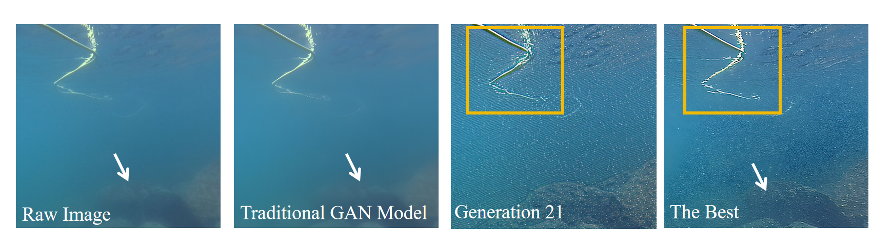

# LLM-Driven Unsupervised Genetic Learning for Underwater Imaging 

Welcome to the underwater adventure of superresolution! If you've ever wanted to see underwater objects in all their high-definition glory without the need for high-resolution labels, you're in the right place.

## 🌊 What's This About?
This repository holds the code for our work on **LLM-Driven Unsupervised Genetic Learning for Underwater Imaging**. It's as cool as it sounds. Dive in to explore how large language models can help us achieve object superresolution in underwater images.

## 🎬 Demo Time!
### Demo Images
Witness the magic of our method as it enhances underwater images to superresolution levels—without needing ground truth labels. The white arrow highlights the unclear shape of rocks in both the raw image and the processed image from traditional GAN models (including the Diffusion Model). Our method consistently finds the optimal solution tailored to the specific underwater environment. The yellow rectangle indicates the improved signal-to-noise ratio from generation 21 to the end.



### Demo Video
Our demo video to see our method in action for object detection underwater. Spoiler: It's fin-tastic!


## 🛠️ Environment Setup
Setting up your environment is easy. Just run:
```
pip install -r requirements.txt
```

## 🏄 How to Use
To start your underwater imaging adventure, simply run:
```
python main2024.py
```
## 📚 Citation
We know you're excited to cite this groundbreaking work—stay tuned for citation details, which will be coming soon!

If you find this work useful, please don't forget to cite us and give our repository a star to help others discover this method. Feel free to reach out to me at yuanzheng@berkeley.edu for any questions or feedback.
